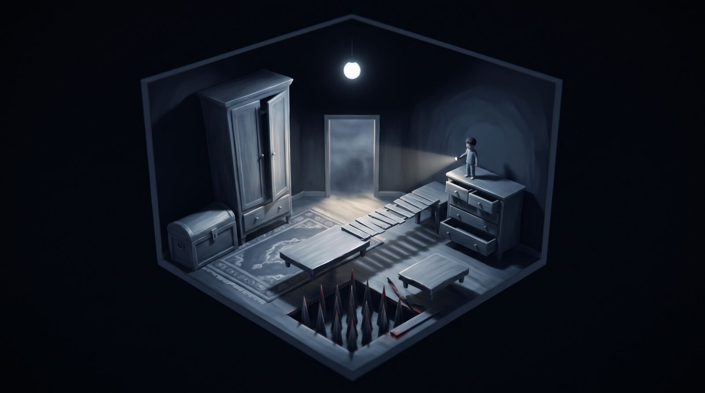
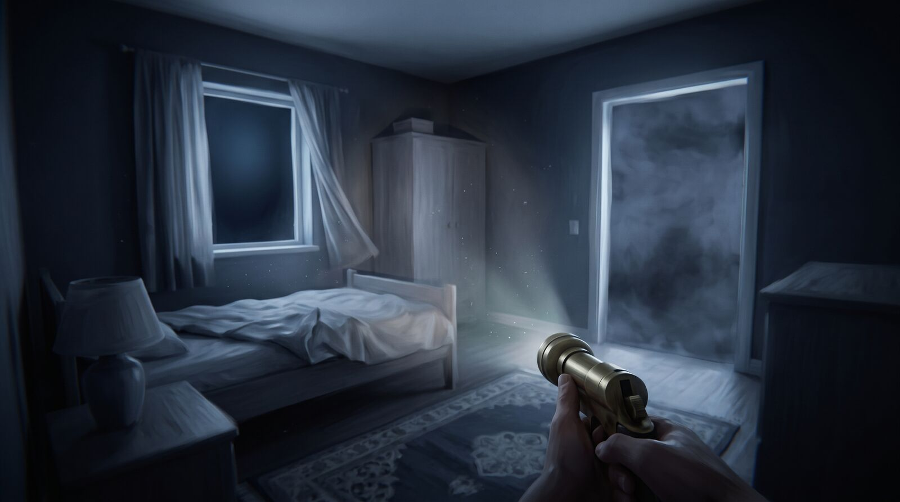
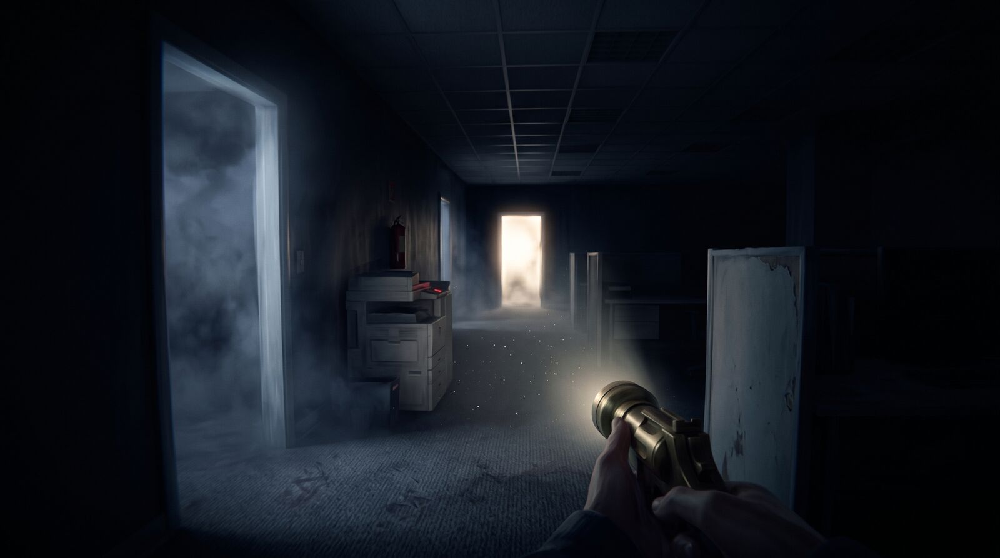
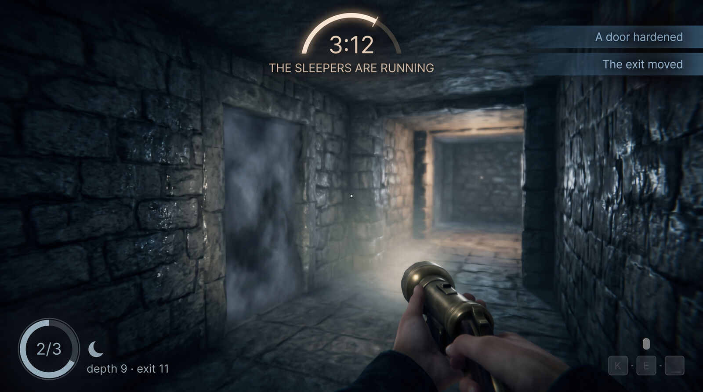
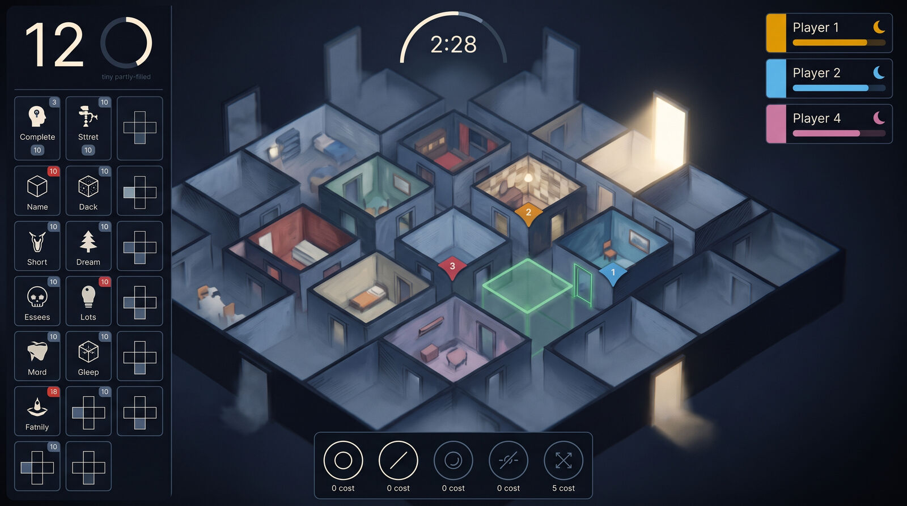
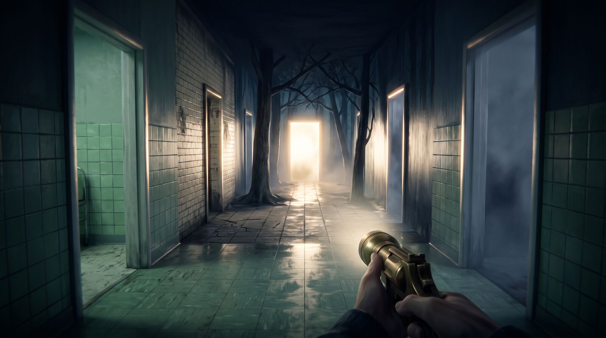
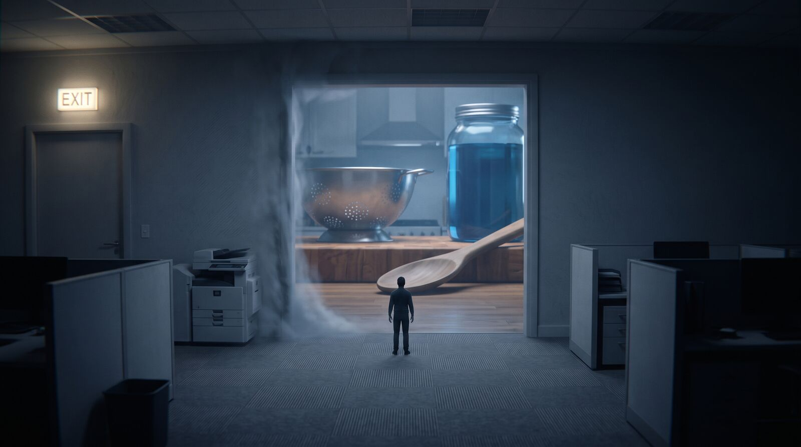
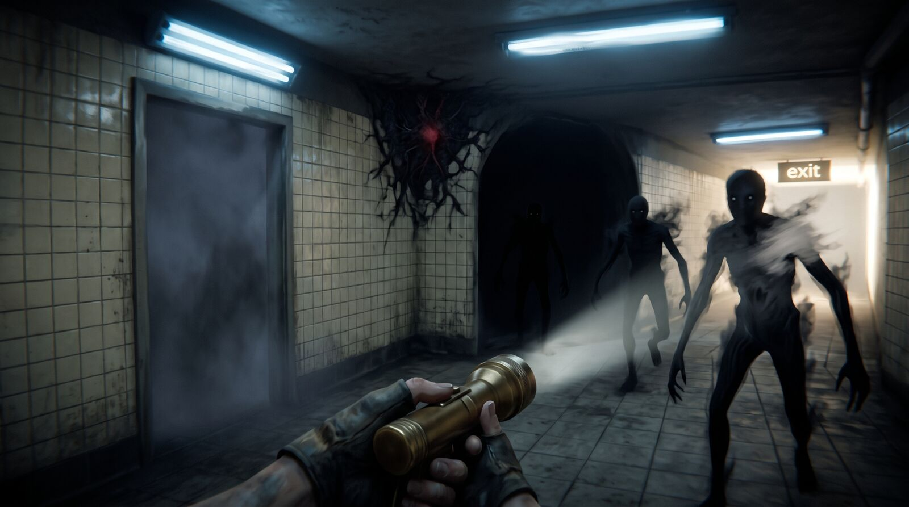
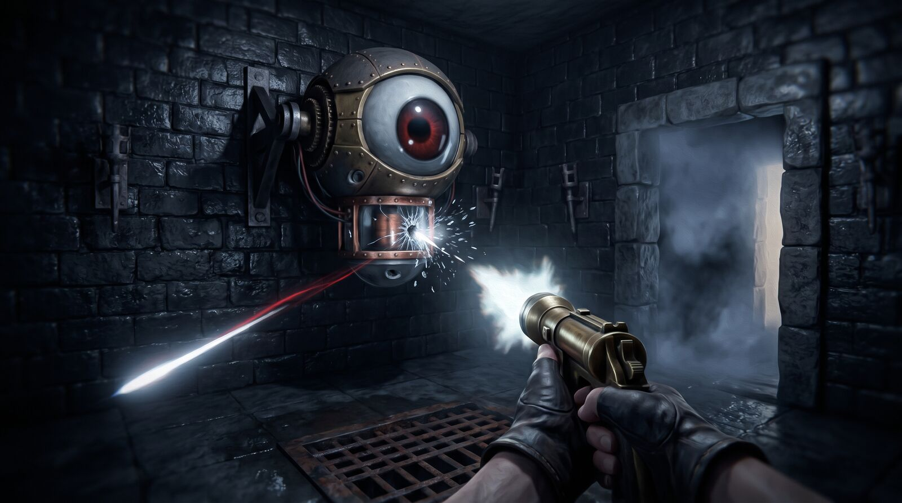
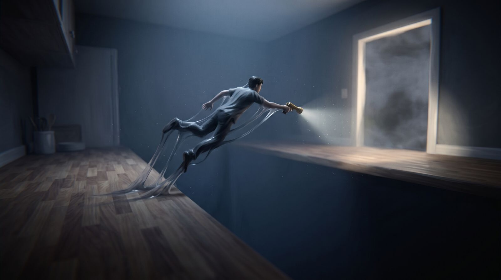

# Lucid

An online party game for 2–5 friends. One player, the **Nightmare**, builds a dream in real time out of cube-shaped rooms and haunts it. The others, the **Sleepers**, each run the same maze alone, jumping and shooting their way to the deepest edge of the dream to wake up before dawn.

Unity 6 · Netcode for GameObjects · Steam · MIT. Built by one person with Claude Code at hobby pace; contributions welcome once the first Dream Pack has been through the pipeline and `CONTRIBUTING.md` is written from doing it (`docs/WORKPLAN.md` M4).

> **The images below are concept art, not screenshots.** Nothing was captured from a running build: they are AI-generated, made to pin down the look and the feel while the game is written. Some of what they show exists today, most of it is milestones away, and each caption says which. `docs/concept/README.md` has the details.

**One cube, opened up.** The maze is a lattice of 8-metre boxes. Every room is the same box from the outside and anything at all on the inside — a corridor, a drop, a spike pit with a plank across it — and the Nightmare adds one at a time while the Sleepers are already running.

## Status

M0 is under way, and **nothing is playable yet.**

`Lucid.Core` implements the rules engine in full — lattice, depth, exits, the explored rule, budget, powers and scoring — as pure C# with a test for all but one item of its own test list (#84). The cube pipeline builds and validates cubes from a JSON spec. The Sleeper moves, the fog doors behave, and `DreamInstance` replays an event log into standing cubes with their doors wired to the derived state — so far only under a PlayMode test, because no scene assembles one yet. There is no networking and no god view.

**Next:** the scene flow, then the Nightmare's god view, then the first playable offline build (`docs/WORKPLAN.md` §4).

## The dream

**The bedroom.** The start cube: fixed, exempt from every rule, and where Sleepers spawn and respawn. *The cube is built and the respawn works. Its door is meant to stay sealed until the head start ends; Core refuses the wake, but the seal itself is not built — the Runtime has no notion of phases yet (M0.9).*

**Grey beside you, white ahead.** Every doorway with nothing behind it is a **fog door**. Grey is closed and solid to the touch; white is the way out. Neither reads by hue alone. The white doors are the deepest in the dream, and they move further away each time the Nightmare builds on them. A room you have set foot in hardens its remaining doors into wall for good — in *every* Sleeper's dream at once, so the maze can only grow where nobody has been yet. *Built — `docs/SPEC.md` §7, and the mist is a generated-noise shader. A hardened door stops moving and darkens rather than taking on the cube's wall material; that last step is still owed (`docs/DECISIONS.md`, 2026-09-03).*

## What each side sees

**The Sleeper** gets a torch, a timer, lives, and the door language to read the maze by. *The timer and lives are M0, the round flow behind them M0.9, and the toasts M1 (`docs/UI.md` §16). The depth readout in this image is the generator's addition — `docs/UI.md` §6 keeps depth on the Nightmare's screen, not the Sleeper's.*

**The Nightmare** sees the whole lattice from above — a palette of cube types, a budget that trickles back, and a ghost that turns red with the reason when a placement breaks a rule. *M0.7. The palette labels in this image are the generator's invention, not cube names.*

## A dream need not make sense

**Rooms are stitched together by connectors, not by architecture,** so a hospital corridor can open into a wood. *The lattice allows this today; rooms like these are M4.*

**Scale is the dream's to choose.** *Unscheduled: giant furniture is a Gimmick cube, and `docs/SPEC.md` §20 parks those in the future-ideas list.*

## Later

The shooter, the mobs and the haunting are M2 and M3. Lucid is a maze runner before it is any of that.

**Things in the dark.** Mobs live in each Sleeper's own dream — plain local gameplay, never networked. *M2.*

**Every trap has a weak point.** Shoot the tell and the room stops trying to kill you. *M2, on the chicane framework in `docs/CHICANES.md`. The real weapon is the Nightlight, "a flashlight that shoots" (`docs/SPEC.md` §9) — this image drew a revolver.*

**Dawn.** Reach a white door and you wake. Whoever is still inside when the night ends does not. *M0.9.*

## Documents

Start with `docs/SPEC.md`; it lists the rest in its §21. Contributors and Claude Code read `CLAUDE.md` first.

## Licence

Code under **MIT**. Original text, briefs, specs, concept art and generated shell textures under **CC-BY-4.0**. Third-party assets keep their own licences and are listed in `THIRD_PARTY_NOTICES.md` — only CC0 and plain CC-BY material is ever committed (`docs/SPEC.md` §18).
